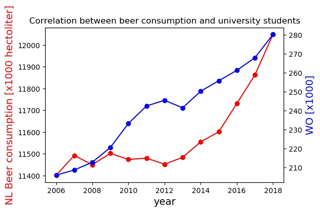

## CS Assignment
### Vera de Brouwer
#### 11299711

MCC van Dyke et al., 2019

> Fantastic yeasts and where to find them: the hidden diversity of dimorphic fungal pathogens
JT Harvey, Applied Ergonomics, 2002 

>An analysis of the forces required to drag sheep over various surfaces
DW Ziegler et al., 2005

>The neurocognitive effects of alcohol on adolescents and college students

The provided data provides the following graph:

